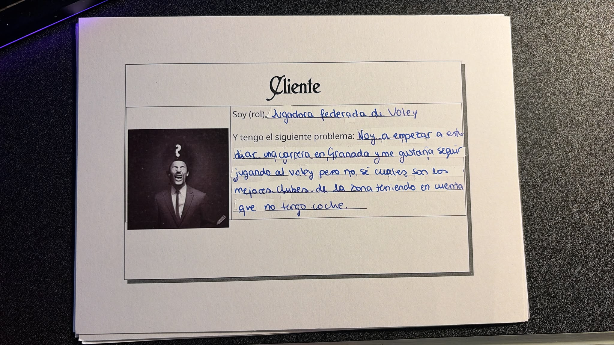

# DeporteSinCoche
## Descripcion

Mi hermana es una jugadora de voley y va a empezar su vida universitaria en Granada, pero no le gustaría dejar
de jugar a lo que ella considera el deporte de su vida. El problema es que no tiene coche para poder ir a los 
entrenamientos y partidos, y tiene que usar el transporte público.
Me cuenta que en la provincia de Granada hay muchos clubes y si tuviera que visitarlos todos para poder
hacer una comparación y decidir a cual apuntarse, le requeriría mucho tiempo y se perdería gran parte de la temporada.
Su intención es visitar sedes de clubes para informarse sobre cada uno y así poder hacer una comparativa y elegir
el mejor club. Uno de sus factores más importantes que esta teniendo en cuenta para tomar esta decisión es la 
accesibilidad de cada club, puesto que no hay ninguno realmente cerca como para ir andando y por tanto, 
le va a ser imperativo coger autobuses. Dice que ya ha visitado varios clubes que tienen una distania aparentemente similar pero que le fue mucho más fácil llegar a uno que a otro debido a 
que le fue mucho más fácil combinar las líneas, paradas y frecuencias de los autobuses.
Así, le resulta muy dificil evaluar y comparar objetivamente las distintas opciones de la provincia antes de tomar una decisión que marcará toda su temporada.

## Configuración del repositorio
[Configuración SSH y perfil](docs/configuracion/)